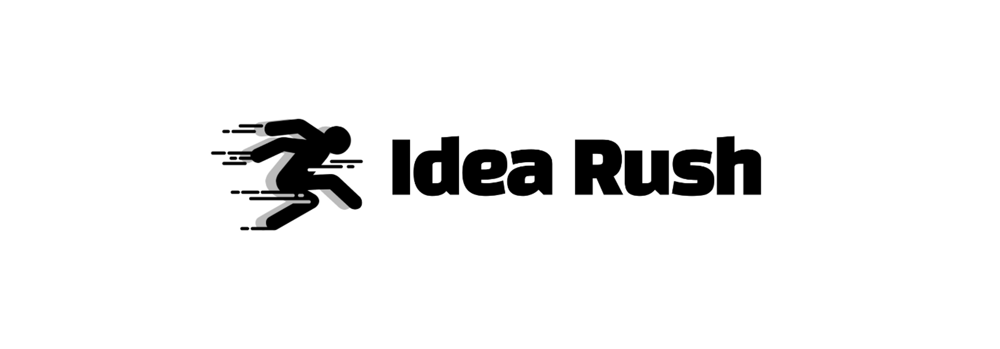
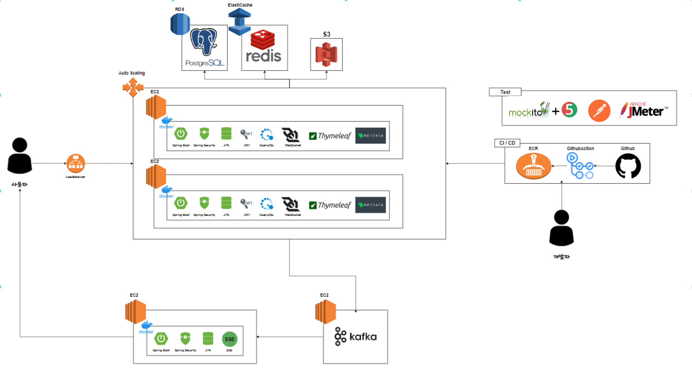
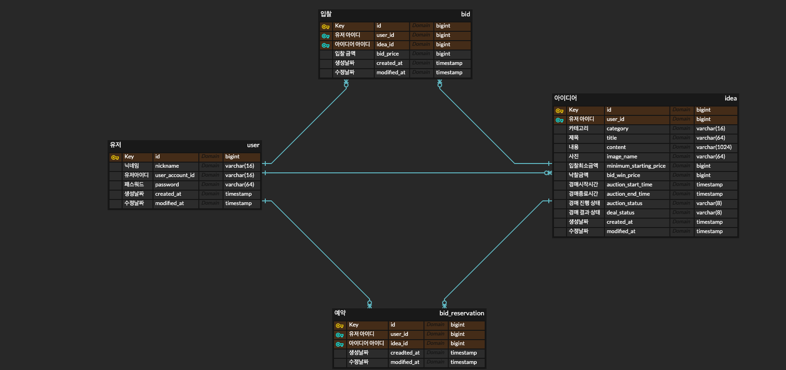

# Idea Rush



# Project Introduce

---
```
일상생활에서 번뜩이는 아이디어를 간편하게 등록하고, 참신한 아이디어를 낙찰 받아 Develop의 기회를 얻을 수 있는 경매 사이트
  
  1️⃣ 실시간 아이디어 입찰    
     많은 사람들의 입찰 경쟁 속에서 모든 사용자가 원활하게 입찰을 할 수 있어야 합니다.
     경매에 참여하는 모든 사람들에게 현재 입찰 가가 동일하게 제공 되어야 합니다.
    
  2️⃣ 아이디어 조회  
     서비스 사용자들이 전체, 카테고리, 키워드 검색 조회를 빠르게 응답 받을 수 있어야 합니다
    
  3️⃣ 대용량 트래픽 제어  
     서비스를 사용하는 사용자가 한 순간에 폭발적으로 증가하더라도 모든 사용자가 원활하게 응답을 받을 수 있어야 합니다.
```

# Team Community

---
📙 [Idea-Rush Jira](https://it-test-test.atlassian.net/wiki/spaces/final/overview) 

📗 [Idea-Rush Brochure](https://www.notion.so/Idea-Rush-Develop-0b98203753584e48b4c901e76d695303#67e8ba09ad2f42b4ae4fc9938c262f2e)

## Tech Stack

---

**FrameWork**


**DB**


**Cloud**


**Deployment**


**Test**


**Monitoring**


---

## Architecture 구성도



## 성능 개선
👉 [성능 개선 보러가기](https://www.notion.so/Idea-Rush-Develop-0b98203753584e48b4c901e76d695303?pvs=25#3a6f01d55fc94730b616e19d7f517f19)

## 기술적 의사 결정
👉 [기술적 의사 결정 보러가기](https://it-test-test.atlassian.net/wiki/spaces/final/pages/2949277)

## API
👉 [API 보러가기](https://it-test-test.atlassian.net/wiki/spaces/final/pages/2752580/API+v1)

## ERD



# 팀원 소개

| Name | Email                    | GitHub                            | Blog                                        |
|------|--------------------------|-----------------------------------|---------------------------------------------|
| 정지현  | ironprayer1208@gmail.com | https://github.com/ironprayer     | https://communication-with-it.tistory.com/  |
| 김기범  | enrhl01122@naver.com     | https://github.com/kibeomKim91    | https://kirbermy.tistory.com/               |
| 권종원  | ty_ty123@naver.com       | https://github.com/Domae-back-end | https://domae.tistory.com/                  |
| 권능현  | sbe4488@naver.com        | https://github.com/NHclub         | https://nh-club.tistory.com/                |

---
